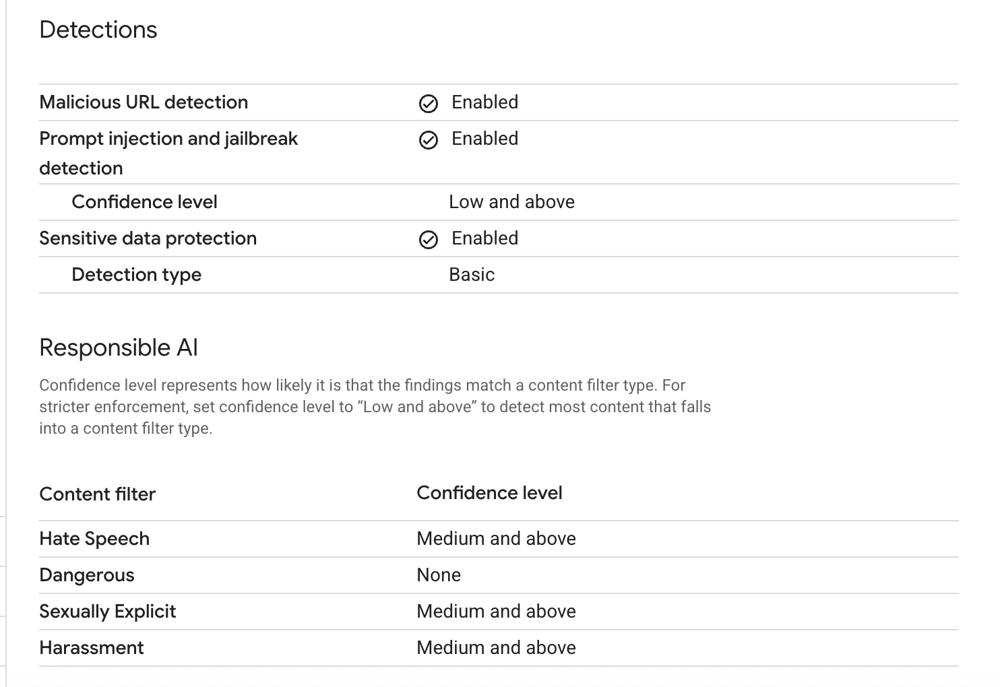

# Apigee MCP Gateway

This project implements a Model Context Protocol(MCP) Gateway using Apigee for Streamalble and Server-Sent Events (SSE) MCP servers.

## Project Overview

This project consists of three main components:

1. **FastAPI SSE MCP Service** - A streaming MCP server using Server-Sent Events
2. **FastMCP Streaming Service** - A FastMCP-based streaming implementation
3. **Apigee Proxy** - API Gateway configuration for MCP services with security and monitoring

## Prerequisites

- Python 3.8 or higher
- `uv` package manager (recommended) or `pip`
- Google Cloud SDK (for Apigee integration)
- Apigee Edge or Apigee X/Hybrid access
- Service account with Apigee Admin permissions

## Installation

1. Clone the repository
2. Create and activate a Python virtual environment:

```bash
# Create virtual environment
python -m venv venv

# Activate virtual environment
# On macOS/Linux:
source venv/bin/activate
# On Windows:
.\venv\Scripts\activate
```

3. Install dependencies:
```bash
pip install -r requirements.txt
```

## Project Structure

```
apigee-mcp-gateway/
├── fastapi-sse-mcp/        # SSE-based MCP sample implementation
├── fastmcp-streaming/      # Streaming service sample implementation
├── requirements.txt      # Project dependencies
├── start_sse.sh         # Script to start SSE service
└── start_streaming.sh   # Script to start streaming service
```

## Running the Services

You can deploy these services in a VM so that Apigee can consume these services.

### SSE Service

To start the SSE service:

```bash
./start_sse.sh
```

This will start the FastAPI SSE service with hot-reload enabled.

### Streaming Service

To start the streaming service:

```bash
./start_streaming.sh
```

This will start the FastMCP streaming service on port 8080 with debug logging enabled.

## Apigee Gateway Configuration

### Apigee Policies

Apigee can act as a MCP gateway providing a series of functionality to MCP Servers
- **Rate Limiting**: Prevents abuse and ensures fair usage
- **Authentication**: Secure access control for MCP endpoints
- **Monitoring**: Real-time analytics and logging
- **Throttling**: Intelligent request throttling based on usage patterns
- **Logging & Auditing**: Log and Audit each request/response.
- **Sanitize User Prompt and Response**: Sanitize MCP Server against malicious User Prompts to prevent Jail break 


### Upload Apigee Proxy

1. **Prepare the Proxy Bundle(Only if using CLI)**:
   ```bash
   mkdir -p apigee-proxy
   zip -r resources/mcp-gateway-demo-policies.zip apigee-proxy/apiproxy/
   cd apigee-proxy
   ```

2. **Upload to Apigee**:
   ```bash
   # Use GCP Console to upload the bundle mcp-gateway-demo-policies.zip directly from the resources folder. 
   
   # Using Apigee CLI
   apigeecli apis create bundle -f mcp-gateway-demo.zip -n mcp-gateway-demo
   
   # Or using Apigee Management API
   curl -X POST \
     -H "Authorization: Bearer $APIGEE_TOKEN" \
     -H "Content-Type: application/zip" \
     --data-binary @mcp-gateway-demo.zip \
     "https://apigee.googleapis.com/v1/organizations/$ORG/apis"
   ```

3. **Create a Model Armor Template**

From the GCP Console, search for Model Armor Template and create a tenplate apigee-modelarmor-template with parameters similar to the one shown below



4. **Create a ModelArmor Invoker Service Account**

Apigee needs a service account to invoke the model armor. Create a service account with Model Armor User and Model Armor Viewer roles.

5. **Update Target Server Configuration**:
   - Navigate to Apigee  UI → APIs → mcp-gateway-demo
   - Go to Target Servers
   - Update the `mcp` target server with your MCP service URL
   - Update the `default` target server with your streaming service URL

6. **Update the Model Armor Condiguration**:

Update the template name in the SUP-UserPromt policy.

```bash
    <?xml version="1.0" encoding="UTF-8" standalone="yes"?>
    <SanitizeUserPrompt async="false" continueOnError="false" enabled="true" name="SUP-UserPromt">
    <IgnoreUnresolvedVariables>true</IgnoreUnresolvedVariables>
    <DisplayName>SUP-UserPromot</DisplayName>
    <ModelArmor>
        <TemplateName>projects/bap-amer-west-demo1/locations/us-west1/templates/apigee-modelarmor-template</TemplateName>
    </ModelArmor>
    <UserPromptSource>{request.content}</UserPromptSource>
    </SanitizeUserPrompt>
```

7. **Deploy the Proxy**:

You can deploy from the Console or you can use apigeecli to deploy. In the service account section put the service account name,

   ```bash
   # Deploy to specific environment
   apigeecli apis deploy -s sa.json -n mcp-gateway-demo -e prod -r 1
   ```

### 5. Create API Keys 

You can use GCP Console to create Products and Keys. Alternatively you can use apigeecli. 

1. **Create API Product**:
   ```bash
   # Create API product for mcp-gateway-demo proxy
   apigeecli products create  \
     --name "mcp-gateway-product" \
     --display "MCP Gateway Product" \
     --envs "prod" \
     --proxies "mcp-gateway-demo" \
     --quota "10000" \
     --interval "1" \
     --unit "month" \
     --approval "auto"
   ```

2. **Create Developer**:
   ```bash
   # Create a developer account
   apigeecli developers create  \
     --email "developer@example.com" \
     --first "Demo" \
     --last "Developer" \
     --user "demo_developer"
   ```

3. **Create Developer App**:
   ```bash
   # Create an app for the developer with access to the API product
   apigeecli apps create  \
     --name "mcp-gateway-app" \
     --email "developer@example.com" \
     --prods "mcp-gateway-product"
   ```

4. **Get API Key**:
   ```bash
   # List the apps to get the API key
   apigeecli apps list  --name "mcp-gateway-app"
   ```

The API key from the developer app will be used to authenticate requests to the proxy endpoints. Make sure to save the key for testing in the next section.


### 6. Test Using MCP Inspector

Start a MCP inspector and try connecting to Apigee Endpoint 
1. For HTTP Streaming:
   - Transport: Streamable-http
   - URL: https://{apigee-runtime-url}/mcp-gateway-demo/mcp
   - Authentication:
     - Header Name: Authorization  
     - Token: <your-api-key>

2. For Server-Sent Events (SSE):
   - Transport: SSE
   - URL: https://{apigee-runtime-url}/mcp-gateway-demo/sse
   - Authentication:
     - Header Name: Authorization
     - Token: <your-api-key>

Test both endpoints using the MCP Inspector UI to verify streaming responses and authentication are working correctly.


## Dependencies

The project uses the following main dependencies:

- `mcp` and `mcp[cli]`: Multi-Cloud Platform core and CLI tools
- `anthropic`: For AI/ML capabilities
- `fastapi`: Web framework
- `uvicorn`: ASGI server
- `aiohttp`: Async HTTP client/server
- `google-adk`: Google API Development Kit
- `fastmcp`: FastMCP implementation
- `gunicorn`: Production WSGI server
- `apigeecli`: Apigee command-line interface

## Features

- Real-time streaming using Server-Sent Events (SSE)
- FastAPI-based REST API endpoints
- Multi-cloud platform integration
- Debug logging support
- Hot-reload for development
- Apigee gateway integration with Model Armor
- Service account-based deployment automation
- Comprehensive security and monitoring

## Development

The services are configured for development with hot-reload enabled. For production deployment, consider:

1. Disabling hot-reload
2. Using gunicorn as the production server
3. Setting appropriate logging levels
4. Configuring proper security measures
5. Implementing proper CI/CD pipelines
6. Setting up monitoring and alerting

## Troubleshooting

### Common Issues

1. **Service Account Permissions**: Ensure the service account has sufficient permissions
2. **Proxy Deployment Failures**: Check proxy bundle structure and configuration
3. **Target Server Issues**: Verify MCP service URLs are accessible from Apigee
4. **API Key Validation**: Ensure API keys are properly configured and valid

### Debug Commands

```bash
# Check Apigee CLI version
apigeecli version

# List all proxies
apigeecli apis list

# Check deployment status
apigeecli apis deploy get -n mcp-gateway-demo -e prod

# View proxy logs
apigeecli apis logs -n mcp-gateway-demo -e prod
```

## License

[Add appropriate license information]

## Contributing

[Add contribution guidelines if applicable]
